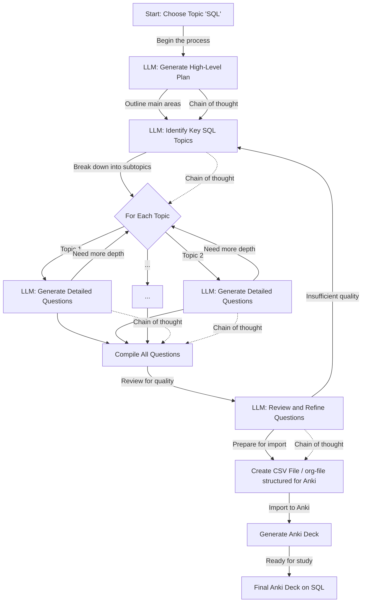

<div class="outline-1 jvc">

## <span class="org-todo todo TODO">TODO</span> About {#about}

This is my first 'project' note page I'm trying. The idea is to put the entire
process down as I ponder and work on things.

<div class="outline-2 jvc">

### The Idea {#the-idea}

This is an idea I've had lolling about in the back of my head, one of those
things that I'm pretty sure someone else has done, but I don't want to look it
up out of fear of killing my motivation. I at least can guess some stupid SaaS
company has made something similar, but probably tied into their own proprietary
product. I'd much rather control the UI and the prompt myself.[^fn:1]

I'm sure (most of you) know how much [spaced repetition software]() rocks. If not
check the underlying link for some resources. Anyways, software like anki can
get complicated, but you can also essentially build your decks out of what are
.csvs. And LLMs, with the proper guardrails are pretty darn good at assembling comma
delimited files / JSON.

You can kind of see where I'm going here, the overall idea is to use proper
prompting to chain a topic out into subtopics, then sucessively build out a
series of questions and answers on the topic, possibly using something like
[Hong, Ruixin and Zhang, Hongming and Pan, Xiaoman and Yu, Dong and Zhang,
Changshui :: Abstraction-of-Thought Makes Language Models Better Reasoners]() to
"reason" about the questions and give less false positives.



High level I could possibly do this inside emacs itself, then keep up the
generation as an artifact for people to wander into and maybe leave
comments.[^fn:2] I'm not entirely sure if it would just be all babel-blocks or
maybe a package that builds on something like [gptel.](https://github.com/karthink/gptel/blob/master/gptel-ollama.el)

 It's also worth pondering the usage of something like gpt4o-mini. While it's
not free, it's cheap enough that I think the cost of an entire deck on a topic
would be less than a dollar or two. I certainly spend money on dumber things.

 I could do this more easily in Python, I suppose, but I kind of wanted to
tinker around with elisp more. Maybe use it to interact with the anki packages
that exist.

</div>

<div class="outline-2 jvc">

### The Attempt {#the-attempt}

<div class="outline-3 jvc">

#### Making sure things are working {#making-sure-things-are-working}

Of course, I'd like to iteratively drill down into actually what I want. It
might be just the data scientist in me, but a bad habit I have is using
notebooks / babel as a first run of things. Maybe it's a good thing, I dunno.

First, a quick test of gptel, to make sure it's working. From the gptel-quick
package, it seems like the request is meant to be the main point of entry for
writing custom prompts.

```emacs-lisp
(require 'gptel)

(defun gptel-hello-world (name)
  (let ((result nil)
        (done nil))
    (gptel-request
     (format "Say a friendly hello to %s in one short sentence." name)
     :callback (lambda (response _info)
                 (setq result response
                       done t)))
    (while (not done)
      (sleep-for 0.1))
    result))

(gptel-hello-world "Justin")
```

<div class="results">

Hello Justin, it's great to chat with you!

</div>

I got it working with ellama but I wanted to see if gptel works for chaining
prompts. Seems like it does. I would note that for all my experiments I'm using
a local small-ish version of llama 3. I'll probably switch to gpt4o-mini/turbo
for the end. Maybe Claude?

```emacs-lisp
(require 'gptel)

(defun gptel-chain-of-thought (question)
  (let ((thoughts '())
        (final-answer nil)
        (done nil))

    ;; Initial thought
    (gptel-request
     (format "Consider this question: %s\nWhat's the first step in answering \
              this? Provide your initial thought." question)
     :callback (lambda (response _info)
                 (push response thoughts)
                 (setq done t)))
    (while (not done) (sleep-for 0.1))
    (setq done nil)

    ;; Generate a series of thoughts
    (dotimes (_ 3)  ; Adjust the number of thoughts as needed
      (gptel-request
       (format "Based on your previous thought: %s\nWhat's the next step in \
                your reasoning?" (car thoughts))
       :callback (lambda (response _info)
                   (push response thoughts)
                   (setq done t)))
      (while (not done) (sleep-for 0.1))
      (setq done nil))

    ;; Final answer
    (gptel-request
     (format "Based on your chain of thoughts:\n%s\nWhat's your final answer \
                to the original question: %s"
             (mapconcat 'identity (reverse thoughts) "\n")
             question)
     :callback (lambda (response _info)
                 (setq final-answer response
                       done t)))
    (while (not done) (sleep-for 0.1))

    ;; Display the chain of thought
    (dolist (thought (reverse thoughts))
      (message "Thought: %s" thought))
    (message "Final Answer: %s" final-answer)

    final-answer))

;; Example usage
(gptel-chain-of-thought "I'm making an anki deck for SQL, what are 10 sub-topics to study")
```

<div class="results">

Based on our conversation:

1.  Data types (int, varchar, datetime)
2.  Table operations (CREATE, ALTER, DROP)
3.  Querying (SELECT, FROM, WHERE, JOIN)
4.  Data manipulation (INSERT, UPDATE, DELETE)
5.  Views and subqueries
6.  Indexes and optimization techniques
7.  SQL functions and aggregations (e.g., SUM, AVG, COUNT)
8.  Common errors and pitfalls to avoid
9.  Advanced SQL topics (e.g., window functions, common table expressions)
10. Best practices for writing efficient and readable SQL code

</div>

</div>

<div class="outline-3 jvc">

#### More Experiments with Chain/Analysis of Thought {#more-experiments-with-chain-analysis-of-thought}

Now that we know it's simple to chain prompts in gptel, let's try
using it for the initial part of my idea.[^fn:3]

Maybe let's try it in Python just for ease..

</div>

</div>

</div>

[^fn:1]: Why pay for a fancy UI if you can write the prompts yourself? This is why I
    love LLMs but am a bit bearish on a lot of their costs are just an abstraction
    over someone being clever with a prompt. The average populace probably doesn't
    care, though.
[^fn:2]: Ideally something like "Hey, I'm an expert in this and this question is
    totally wrong! Here's why!" - They say that expertise is knowing all the
    footguns, but I've also noticed people will closely guard things that give them
    an edge: "It's not my job to educate you!"
[^fn:3]: Okay, so uh, I had some trouble with callbacks and such for emacs based llms,
    might just continue this in Python but keeping the previous parts for posterity
    / showing my chain of thought
